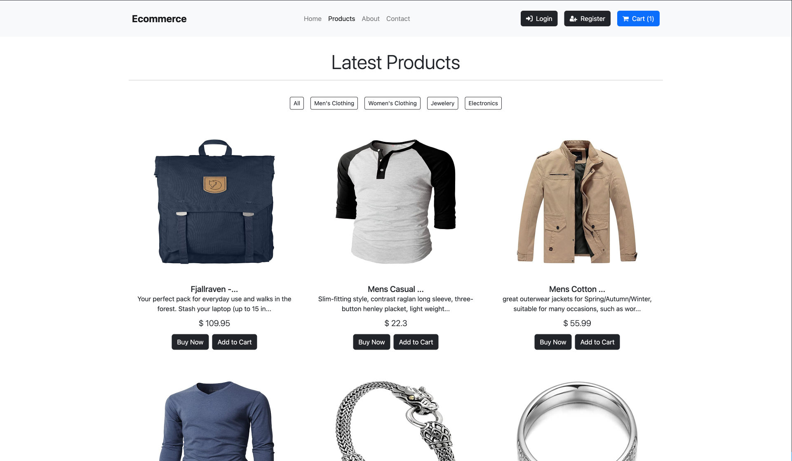
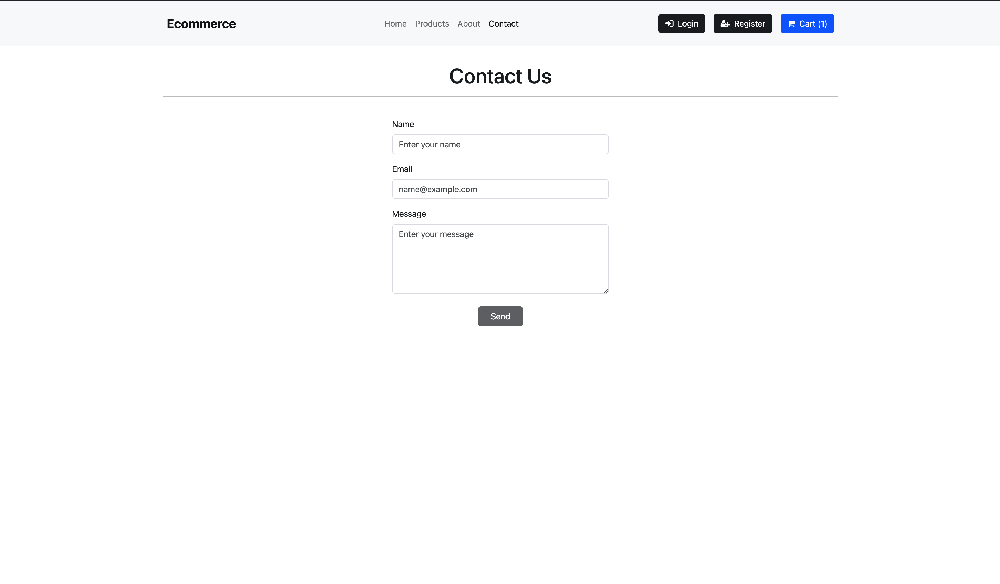
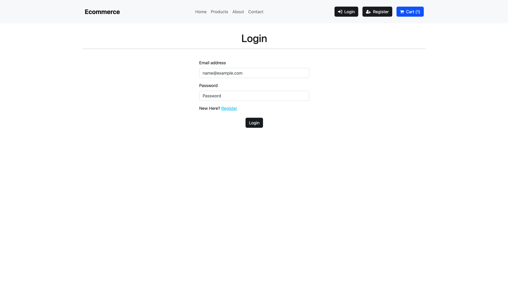
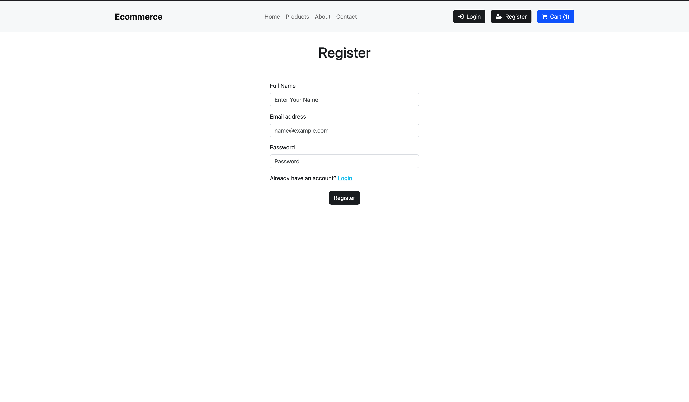
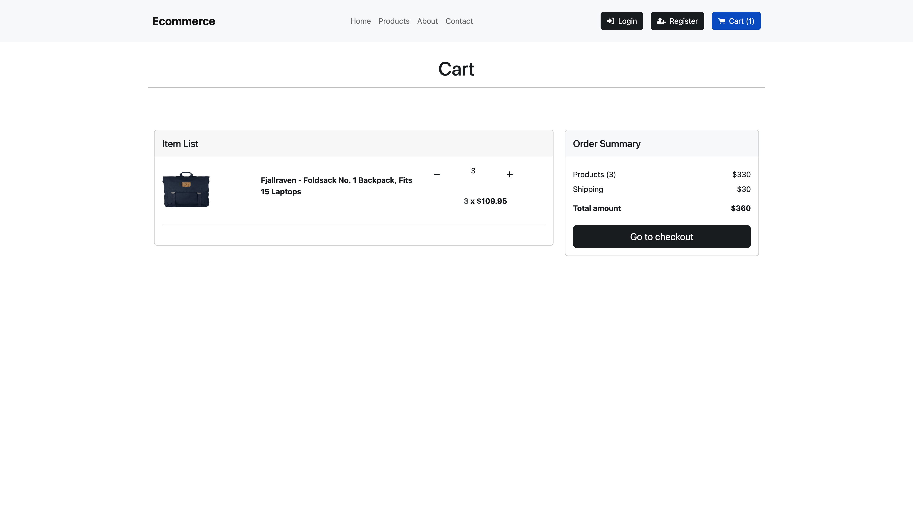
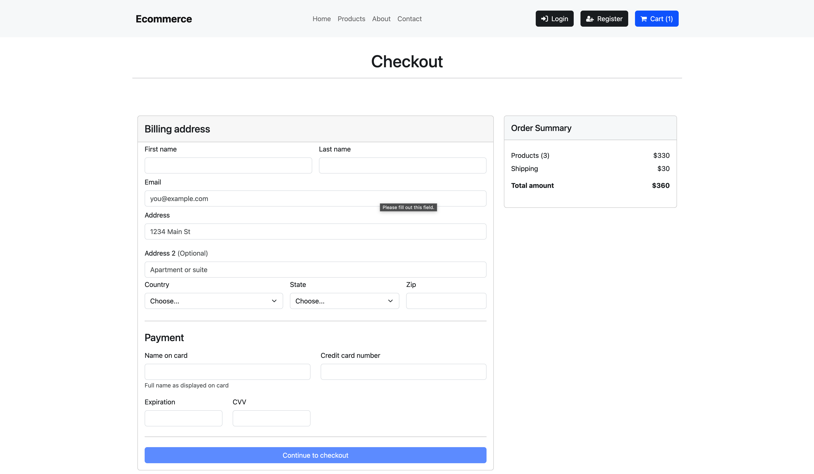

  
  <h1 style="position: absolute; top: 50%; left: 40%; transform: translate(-20%, -60%); font-size: 4rem; color: white;">
    Ecommerce Website
  </h1>

### Overview

This is a basic eCommerce website developed using React for the front-end and Node.js for the back-end. The application allows users to register, log in, browse the inventory, add products to their cart, and save them for later.

### Key Features

#### 1. User Profile Creation:

- Users can register, log in, and manage their accounts.

#### 4. Contact Us Page:

- For any help or guidance users can reach out to help desk throughout the form

#### 5. About Us Page:

- We are going to provide the basic information about the application. For example, what does this application do? for now you can see some random text.

### Future Works

#### 1. Check Out:

- The checkout feature is currently disabled but will be implemented in the future. This will allow users to review their cart, input shipping details, and complete the purchase.
#### 2. Admin Panel:
- An admin interface will be added to manage product inventory and process orders.

### Technology Used
      

### Our Work
<table style="width:100%">
  <tr>
    <td style="padding:20px; width: 600px;">
      
    </td>
    <td style="padding:20px; width: 600px;">
      
    </td>
    <tr/>
    <tr>
    <td style="padding:20px; width: 600px;">
      
    </td>
    <td style="padding:20px; width: 600px;">
      
    </td>
    <tr/>
    <tr>
    <td style="padding:20px; width: 600px;">
      
    </td>
    <td style="padding:20px; width: 600px;">
      
    </td>
    <tr/>
    <tr>
    <td style="padding:20px; width: 600px;">
      
    </td>
    <td style="padding:20px; width: 600px;">
      
    </td>
    <tr/>
    <tr>
    <td style="padding:20px; width: 600px;">
      
    </td>
    <tr/>
  <!-- Add more rows as needed -->
</table>

### Contributers

<table style="border-collapse: collapse; border: none;">
<tr align="center" style="border-collapse: collapse; border: none;">
<td style="border:none">Satya Nandan Thota</td>
<td style="border:none">Sri Ramgopal Tandra</td>
</tr>
<tr align="center">
<td style="border:none"></td>
<td style="border:none"><a href="https://github.com/SR-Naidu" style="text-decoration: none;">
    </img>
  </a></td>
</tr>
</table>
